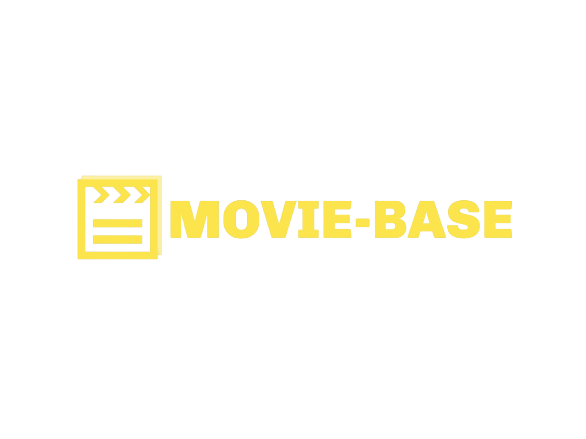
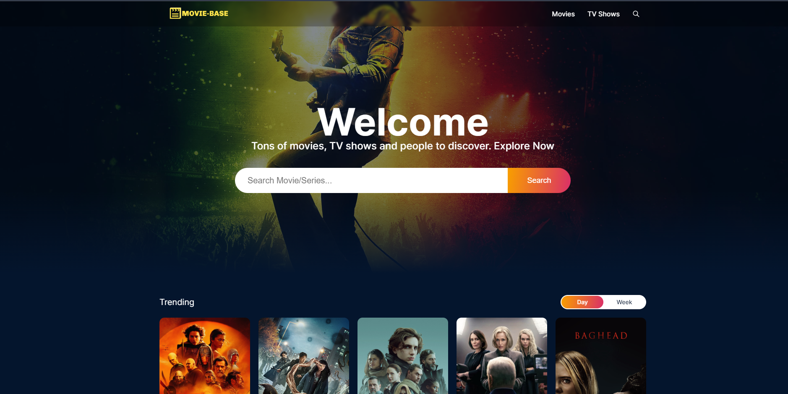

## Table of Contents

- [Table of Contents](#table-of-contents)
- [About the Project](#about-the-project)
- [Features](#features)
- [Installation](#installation)
- [Installation (If you have docker installed)](#installation-if-you-have-docker-installed)
- [Technologies Used](#technologies-used)
- [Future Development](#future-development)

## About the Project


Movie-base was designed to streamline the movie discovery process, combining a visually appealing UI with intuitive navigation and filtering tools. I aimed to create an experience that simplifies finding the perfect movie to watch, making it enjoyable for movie enthusiasts.


## Features

- Search Functionality:
- Quickly find movies by title or keyword.
- User-Friendly Filtering: Narrow down search results by genre, release date, rating, and more.
- Visually Appealing Design: An attractive layout emphasizes movie posters and key information for easy browsing.
- Responsive Interface: Adapts seamlessly across different screen sizes (desktop, tablet, mobile).
- REST API Integration: Fetches movie data dynamically for a smooth and up-to-date user experience.

## Installation

- Clone the repository: git clone https://github.com/abhijeetjohnkujur/Movie-base.git
- Navigate to the project directory: 
  ```nodejs
    cd Movie-base
- Install dependencies: 
  ```nodejs
    npm install
- Start the development server: 
  ```nodejs 
    npm start
## Installation (If you have docker installed)

- Build docker image (ngnix version): 
  ```nodejs
  
  docker build -t movie-base .
  docker images
  docker run -d -p 80:80 --name <image name> movie-base:latest

## Technologies Used

- React.js
- Tailwind CSS
- TMDB API
- JavaScript

## Future Development

- Implement user authentication for saving favorite movies.
- Personalized Database

